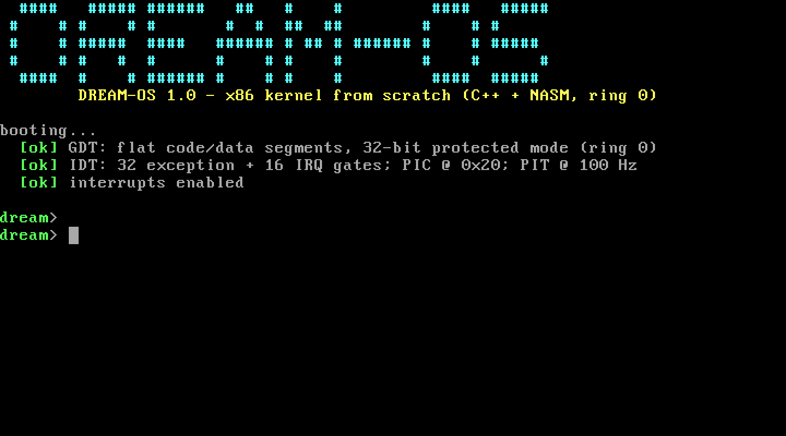
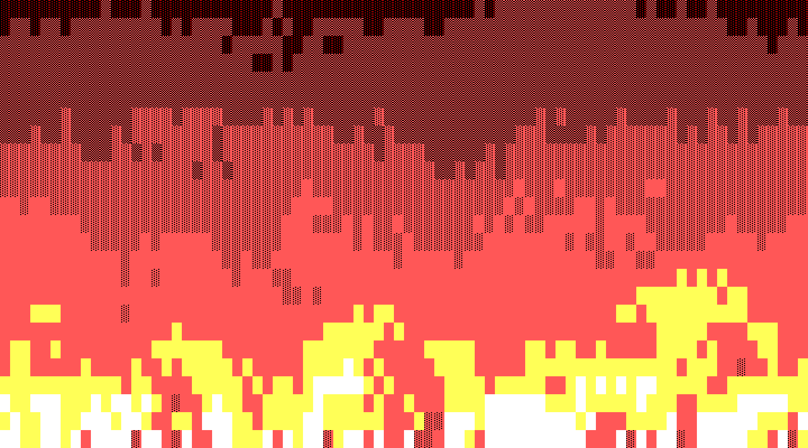
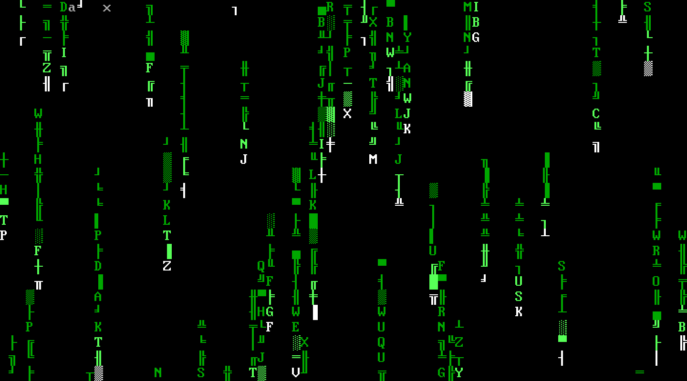

# DREAM-OS

Собственное ядро операционной системы x86, написанное **с нуля**: freestanding
C++ и NASM-ассемблер, без libc, без рантайма, без единой готовой библиотеки.
Грузится QEMU (multiboot) напрямую как ELF — никакой GRUB не нужен.

Работает в ring 0 в 32-битном защищённом режиме: свой GDT, свой IDT,
обработка исключений CPU, ремап PIC, таймер PIT, драйверы PS/2-клавиатуры
и COM1, текстовое VGA 80x25 и консольный шелл.

| Загрузка | Огонь | Матрица |
|---|---|---|
|  |  |  |

## Зачем это всё

Это «безумная мечта» в чистом виде: программа, у которой нет под собой ни
ОС, ни библиотек — только ты, CPU и железо. Несколько моментов, ради которых
оно того стоит:

- **`div0` — ядро переживает деление на ноль.** Обработчик #DE правит
  сохранённый на стеке `EIP` (`+2` — ровно длина `F7 /6`) и выполнение
  продолжается, как ни в чём не бывало.
- Весь ввод-вывод — честные `in`/`out` в порты, никакого mmap-магии.
- `cpuid`/`rdtsc` — общение с процессором напрямую, по-настоящему.
- ASCII-огонь и matrix rain, нарисованные символами CP437 (░▒▓█) прямо
  в видеопамять по адресу `0xB8000`.

## Запуск

Нужны: `g++` (с поддержкой `-m32`), `nasm`, `qemu-system-i386`.

```bash
make        # собрать bin/kernel.elf
make run    # интерактивно: VGA + клавиатура (выход из QEMU: Ctrl-A, затем X)
make test   # headless end-to-end тест: команды через COM1, проверка ответов
```

На реальном железе образ тоже должен грузиться любым multiboot-загрузчиком
(GRUB): `kernel.elf` — валидный ELF32 с multiboot-заголовком.

## Команды шелла

| Команда | Что делает |
|---|---|
| `help` | список команд |
| `about` | что это за система |
| `clear` | очистить экран |
| `cpuid` | вендор, сигнатура и бренд CPU (инструкция `CPUID`) |
| `rdtsc` | счётчик тактов с включения (`RDTSC`, 64 бита) |
| `uptime` | время с загрузки (PIT на 100 Гц) |
| `meminfo` | объём RAM из multiboot info |
| `fire` | ASCII-огонь (выход — любая клавиша) |
| `matrix` | matrix rain (выход — любая клавиша) |
| `div0` | деление на ноль и выживание |
| `reboot` | перезагрузка через контроллер 8042 |

Консоль работает и с клавиатуры, и через COM1 — поэтому ядро можно
управлять скриптом: `printf 'help\n' | qemu-system-i386 -display none
-kernel bin/kernel.elf -serial stdio`.

## Как это устроено

```
boot/boot.asm     multiboot-заголовок, стек, вызов глобальных конструкторов, kmain
linker.ld         образ с 1 МБ, .multiboot в первых байтах, .init_array
src/gdt.asm       GDT (null + flat code/data), lgdt + far jump
src/isr.asm       32 заглушки исключений + 16 IRQ, общий хвост → C-обработчик
src/interrupts.cpp IDT, PIC (ремап на 0x20-0x2F), PIT на 100 Гц, хендлеры
src/keyboard.cpp  scancode set 1 → ASCII, кольцевой буфер, shift/caps
src/serial.cpp    COM1 115200, зеркалирование всего вывода
src/vga.cpp       текстовый VGA 80x25, курсор, скролл, палитра
src/demos.cpp     огонь (тепло+ветер+затухание) и matrix rain
src/shell.cpp     шелл: линии, история не нужна, таблица команд
src/kmain.cpp     порядок инициализации и баннер
scripts/screenshot.py  скриншоты VGA через монитор QEMU (нужен Pillow)
```

Порядок загрузки: QEMU (multiboot) → `_start` в boot.asm → свой стек →
глобальные конструкторы C++ → `kmain` → GDT → IDT+PIC+PIT → `sti` → шелл.

Пара неочевидных граблей, на которые наступить пришлось:

- **Tail-call в обработчике прерываний.** GCC может исполнить последний
  вызов как `jmp`, записав аргумент в «свои» outgoing-args — а это слот на
  стеке, где лежит наш сохранённый `ds`. Поэтому между кадром прерывания и
  вызовом C-обработчика лежит pad из 4 dwords.
- **`push` указателя кадра** должен идти *после* pad — иначе обработчик
  получает в качестве аргумента мусор (симптом: таймер «идёт», но
  `tick_count` всегда 0).

Экранный текст — на английском: шрифт VGA в текстовом режиме — CP437,
кириллицы в нём нет (загрузка своего шрифта — из идей развития).

## Лицензия

[MIT](LICENSE) — делайте что хотите, только сохраните копирайт.

## Проверка

`make test` грузит ядро в QEMU без окна, подаёт команды в COM1 и сверяет
ответы: баннер, инициализация GDT/IDT/PIC/PIT, все команды, выживание после
#DE, обработка неизвестной команды, reboot. 12/12 проверок зелёные.

## Идеи развития

- свой шрифт и кириллица;
- страничная адресация и user mode (ring 3);
- FAT12-драйвер и чтение дискеты;
- многозадачность через TSS и таймслайсы уже есть из чего вырасти — PIT тикает;
- портировать огонь в графический режим 13h (320x200, палитра VGA).
